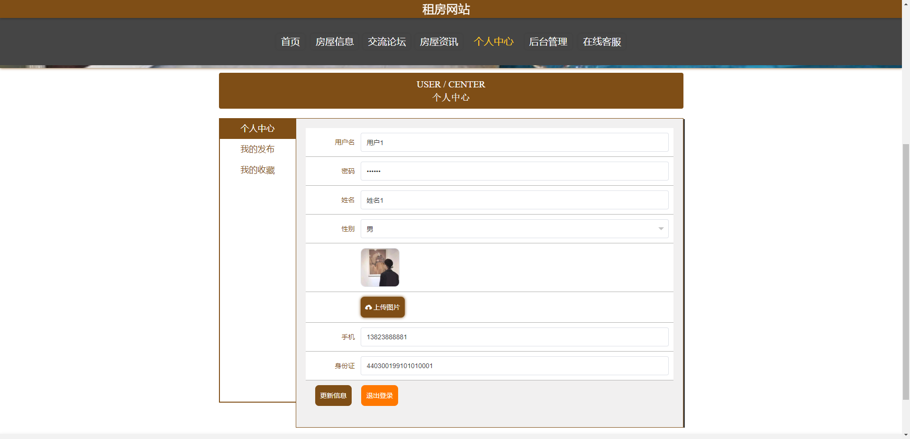

# 1 项目介绍
基于SSM+Vue的租房网站：后端 SpringBoot、Mybatis-Plus，前端Vue+ElementUI，具体功能如下：
## 管理端
- 个人中心：查看和修改个人信息、修改密码
- 用户管理
- 房屋类型管理
- 房屋信息管理
- 房屋评价管理
- 在线签约管理
- 轮播图管理
- 在线客服
## 用户端
- 首页
- 房屋信息
- 房屋资讯
- 交流论坛
- 在线客服
- 个人中心
# 2 系统运行截图
## 2.1 用户登录

## 2.2 房屋信息

## 2.3 房屋详情

## 2.4 个人中心

## 2.5 房屋信息

## 2.6 在线签约

## 2.7 交流论坛

## 2.8 万字文档

## 2.9 PPT

# 3 数据库设计

# 4 源码数据库获取(收费)

